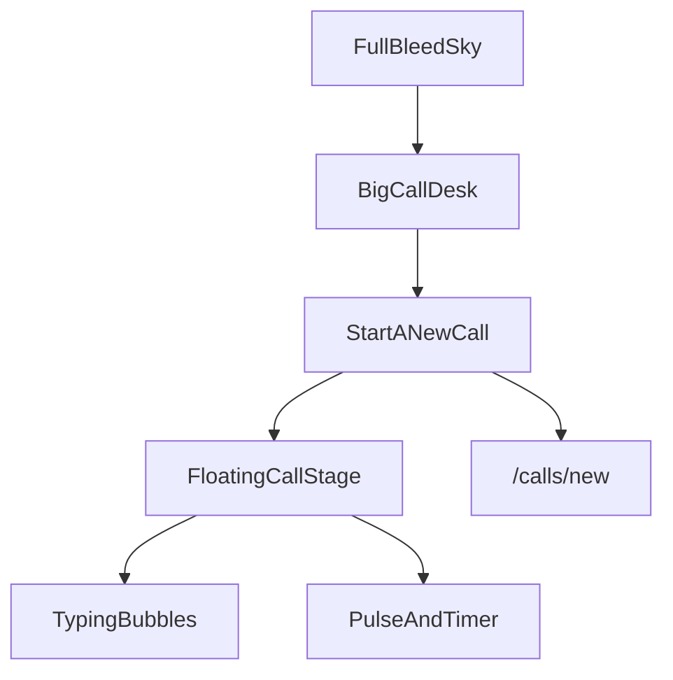

# CallDesk hackathon landing

Hackathon demo landing inspired by Aiden’s sky hero — full-bleed cloud sky, oversized CallDesk centered, “Start a new call” CTA, with the animated live-call product floating as the main visual. Dashboard moves to `/calls`.

## Build checklist

- [ ] Split `(marketing)` vs `(app)` layouts; move dashboard to `/calls`; `/` becomes landing
- [ ] Add sky/cloud hero image to `public/` and wire full-bleed CSS background
- [ ] Aiden-style hero: sky plane, big centered CallDesk, Start a new call button
- [ ] Floating animated call stage under brand: bubbles, live pulse, waveform loop
- [ ] Thin below-fold Brief → Live → Notes + repeat CTA

## Direction (locked)

- **Audience:** hackathon judges — 10-second wow, CTA into the real demo
- **Visual reference:** Aiden-style sky hero (bright cyan sky + soft white clouds; product floating over it)
- **Hero hierarchy:** sky = atmosphere · **CallDesk** = big center brand · **Start a new call** = primary CTA · live-call UI = floating product under the brand
- **Tone:** keep Aside tokens (ink, Instrument Sans + JetBrains Mono). Sky supplies the color; UI stays ink-on-light, not purple/dark/cream-serif

## First viewport (Aiden composition, CallDesk content)

Full-bleed sky as the edge-to-edge plane (not the old soft transcript gradient as the hero bg). Centered stack, one composition:

```
[ sky / clouds — full bleed ]
        CallDesk          ← oversized wordmark + mark (hero brand)
   Start a new call       ← black pill CTA → /calls/new
   ┌─────────────────┐
   │  live call UI   │    ← floating product stage (like Aiden’s browser)
   └─────────────────┘
```

| Element | Role |
|---------|------|
| **Sky** | Dominant full-bleed background (user’s cloud image) |
| **CallDesk** | Huge centered brand — the name is the hero signal, not a nav label |
| **Start a new call** | Single primary CTA (ink pill), directly under the name |
| **Call stage** | Large floating product panel under the CTA — animated mock live call |

No secondary headline fighting the brand in the first viewport. Optional one short support line under the CTA only if it still reads as one composition.

Minimal landing chrome: tiny top-left mark or nothing — brand lives in the center.



## Sky asset

- Source: cloud sky PNG from design reference.
- Copy into [`public/hero-sky.png`](public/hero-sky.png) (or `.webp` if we compress).
- CSS: `background-size: cover; background-position: center top;` on a full-viewport hero section.
- Soft slow **cloud drift** (CSS transform on a duplicate layer or subtle `background-position` animation) — one cool motion, not parallax overload.
- Light bottom fade into white if a below-fold section follows, so the product app chrome doesn’t clash.

## Cool elements (inside the floating product stage)

Still product-as-hero content, now framed over the sky:

1. **Auto-playing mock transcript** — 4–6 lines (agent ↔ hotel) fade in on a loop; reuse `.bubble-agent` / `.bubble-hotel`.
2. **Live status** — pill `queued → in_progress → completed` + mono timer while live.
3. **Speaking waveform** — bars on the active agent line.
4. **Outcome beat** — compact *Success · rate held* flash at loop end inside the same panel.

No floating promo stickers on the sky (no “AI-powered” chips). Motion lives in the product + gentle sky drift.

## Below the fold (thin)

One section on a clean white (or pale sky fade) surface:

**Brief → Live call → Structured notes**

One sentence. Repeat **Start a new call**. Not a long Aiden-style marketing page.

## Routing / layout

Today [`src/app/layout.tsx`](src/app/layout.tsx) wraps all pages in `max-w-[1240px]` + product header — that fights a full-bleed sky.

- Route groups:
  - [`src/app/(marketing)/layout.tsx`](src/app/(marketing)/layout.tsx) — full-bleed, no constrained shell
  - [`src/app/(marketing)/page.tsx`](src/app/(marketing)/page.tsx) — sky landing
  - [`src/app/(app)/layout.tsx`](src/app/(app)/layout.tsx) — current max-width shell + header
  - Dashboard: [`src/app/page.tsx`](src/app/page.tsx) → [`src/app/(app)/calls/page.tsx`](src/app/(app)/calls/page.tsx)
  - Keep `/calls/new` and `/calls/[callId]` under `(app)`

Root layout: fonts + metadata only.

## Implementation shape

- `public/hero-sky.png` from the provided sky asset
- `src/components/landing-call-stage.tsx` — mock loop (no API)
- Marketing page: sky section + big **CallDesk** + **Start a new call** + floating stage
- Keyframes in `globals.css`: sky drift, bubble enter, waveform
- Do not rebuild the real live-call page — stage is a lightweight visual twin

## Copy (working)

- Center brand: **CallDesk**
- Primary CTA: **Start a new call** → `/calls/new`
- Secondary (subtle, header or footer of hero): Open desk → `/calls`
- Below-fold support (only): Brief once. Watch it negotiate live. Get structured notes back.
